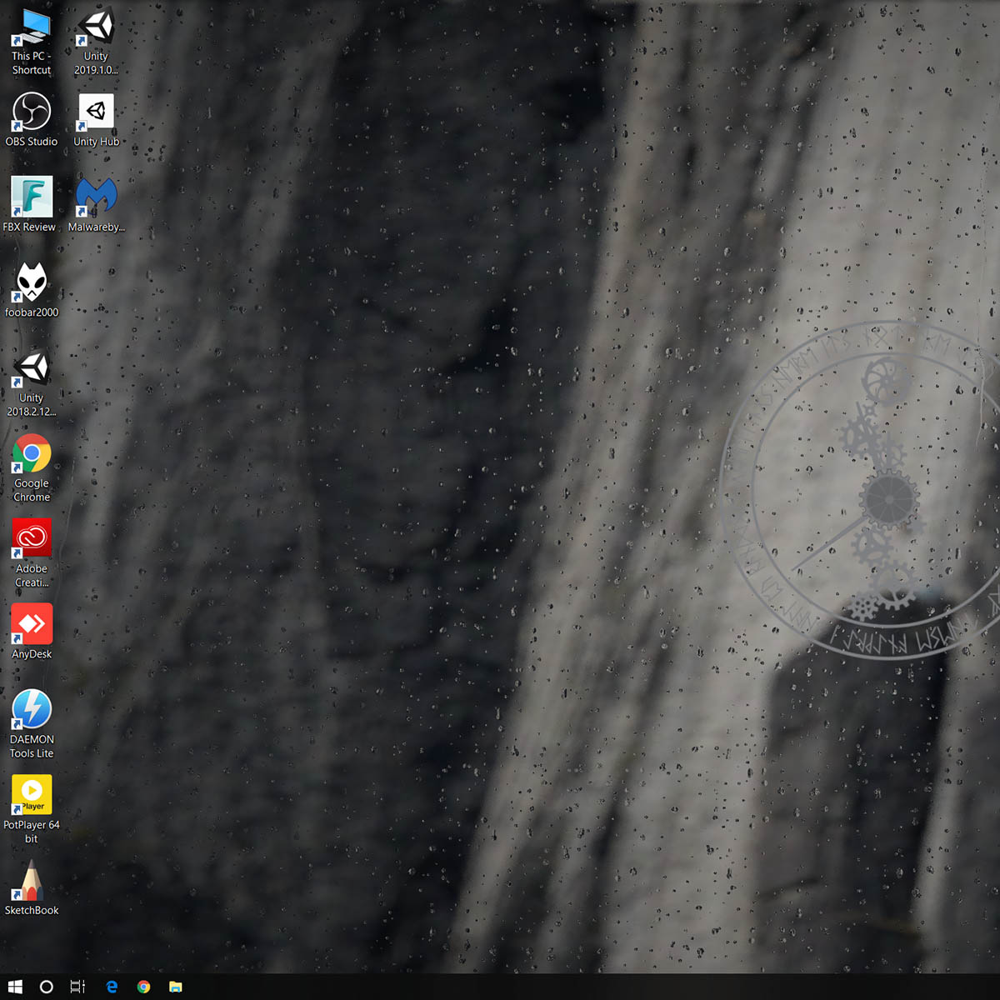
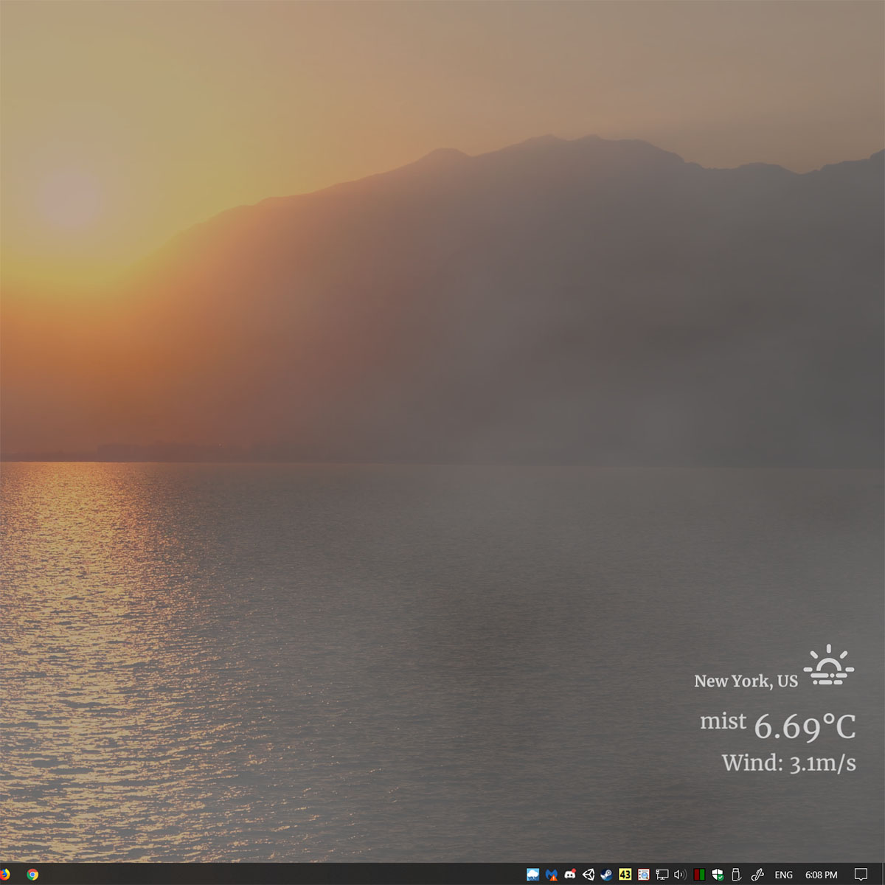
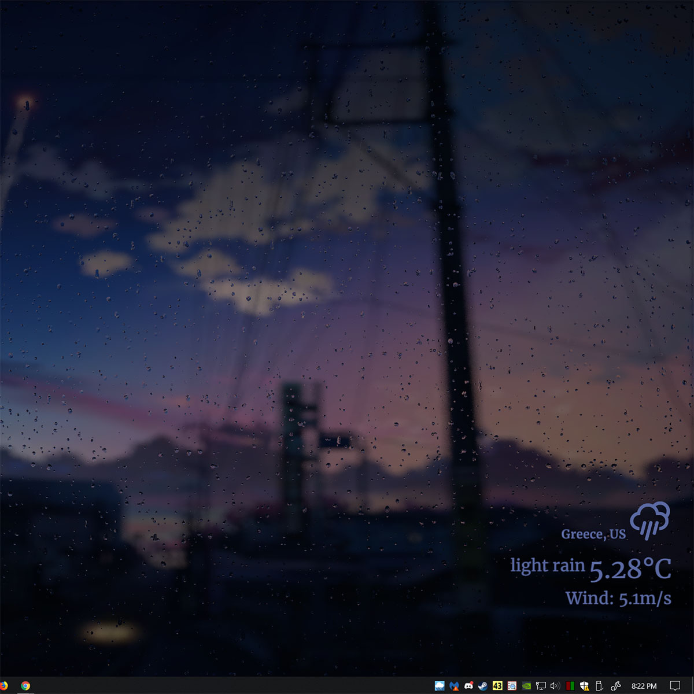
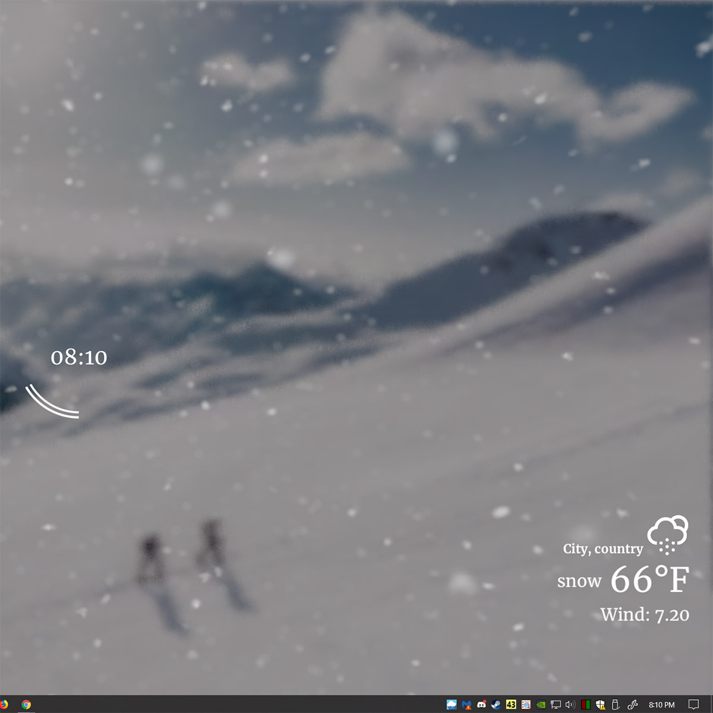

<h1 align="center">

 
rePaper - A window to the the outside world
</h1>

## Contents

- [About](#about)
- [Download](#download)
- [Features](#features)
- [Screenshots](#screenshots)
- [license](#license)
- [Support](#support)

## About

Try to imagine your desktop as a window, as it rains outside you see water droplets dripping down..as it snows you see it get frosted.. as sun rises & sets scenery changes realtime.

Thats the idea behind this software; What started out as a simple idea, after many months of work I present to you rePaper.

When running fullscreen applications or games rePaper will go to sleep (~0% cpu & gpu usage); no performance cost.

_Check out my other Project <a href="https://github.com/rocksdanister/lively/">Lively</a> for a general purpose wallpaper system._
## Download
> ### I'm not working on this project at the moment. For support please use my current, and most updated wallpaper project "Lively" instead: https://github.com/rocksdanister/lively
##### Latest version: v0.5.2 (Windows 10, 8.1, 7)
- [`rePaper.zip`][direct-win64]  
   _(SHA-256: deb31a8637f5c128c611cb9049445a4a0b3def72bbe274846f8a494cbfc2fb4f)_

[direct-win64]: https://github.com/rocksdanister/rePaper/releases/download/v0.5.2/rePaper.zip

Unzip the file, select Start.exe to get started. First run will be slow.

To update application, just delete the folder and extract the new zip.

**Note:** Certain antivirus software may detect some processes of this application as virus. So far AVG has been reported as flagging  rePaper as IDP.ALEXA.51 ; this is a false positive, similar to the case of Attila, Rome II, Warhammer II etc. <a href="https://sensorstechforum.com/what-is-idp-alexa-51-and-should-you-remove-it/">Source</a>. 
**rePaper is fully opensource, you are free to check the code.**

Save files & settings are stored in <username>\Saved Games\rePaper.

## Features
* Video file as wallpaper support (Hardware Accelerated Playback optional)
* Most of the processing is done via gpu shaders, low cpu usage.
* Weather effect appearance is customisable:- raindrop size, speed, blur intensity etc.
* Openweathermap API used to gather weather information. 
  (most of these weather conditions are supported: [https://openweathermap.org/weather-conditions](https://openweathermap.org/weather-conditions))
* Real-time day/night cycle based on sunrise-sunset time.  
* rePaper will pause when running fullscreen application or games (~0% cpu & gpu usage; main execution thread is stopped, background thread used for monitoring).
* rePaper will pause when application focus change (optional).
* Application rule: Set specific rePaper sleep rules based on running application.
* Ultrawide resolution support, multimonitor system support.
* Toggle windows 10 Light/Darkmode automatically based on time (optional).
* Automatically detect clock, text color based on wallpaper (picture wallpaper only).
* Your areas weather might not always be exciting, all the weather effects are user selectable.
* Customizable -  adjustable performance settings (fps, blur quality) , custom UI color, different clock styles & more.
* Appears behind desktop icons.
* Brightness change based on time of day & weather - less bright when clowdy, raining.
* Can be used alongside Rainmeter.
* Additional 4 weather presets for user customisation, turn it into radioactive wasteland, extreme rain..etc
* Runs at system startup (optional).

## Screenshots

  
   
  
  

## License
rePaper is licensed under GPL-3, individual license of used libraries is provided in the source directory.

## Support
If you like what I do & want to support me:

